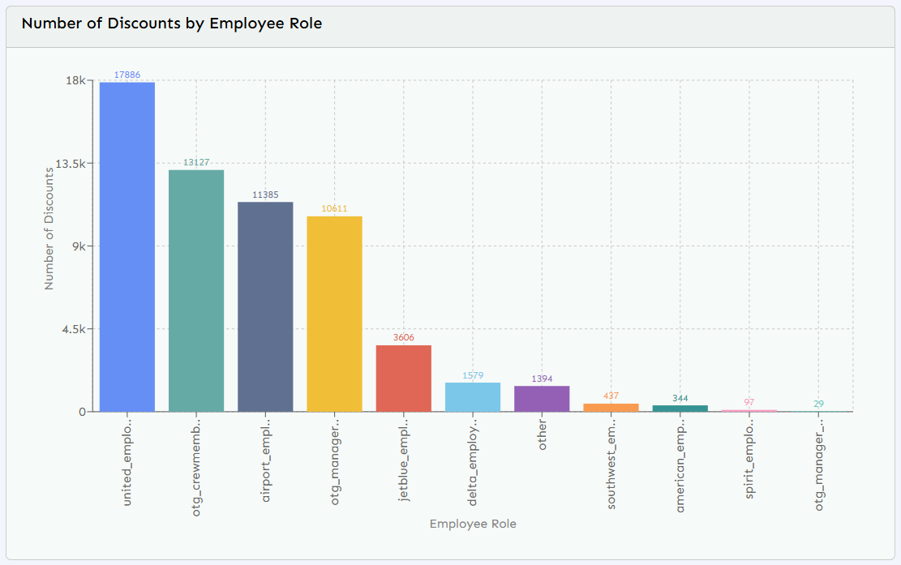

# Text-to-SQL
The Text-to-SQL problem refers to the task of automatically translating a natural language query (in plain English or another language) into a valid Structured Query Language (SQL) statement that can be executed on a database. This area sits at the intersection of Natural Language Processing (NLP) and Database Systems, and it’s becoming important as organizations want non-technical users to query data without learning SQL.

### Major Components for Text-to-SQL System

1. Query Classifier: 
    - The original user query is classified into three possible classes: ChitChat, General and Database.
        - Chitchat: chitchat agent handles the chitchat queries
        - General: general agent handles the generic queries
        -Database: database agent handles the queries realted to database

2. Database Agent: 
    - Tools: 
        - ListSQLDatabase: get the related table names
        - InfoSQL Database: get the table sample row with schema for a given table
        - Query SQL Checker: validate the SQL Query
        - Query SQL Database: execute SQL query and retry for 10 times if failed

3. Visualizer Agent:
    - generate the arguments required to plot the user requested graph


### Evaluation Metrics
1. Semantic SQL Matching 
    - Compares the semantic equivalence of two SQL queries
    - If two SQL queries are semantically equivalent, they will always produce the same logical result (given the same schema and data), even if written differently
2. Execution Based Matching
    - Compares the execution results of two SQL queries
    - If two SQL queries return the same result set when executed on the same schema and data, even if the order of records or formatting differs, they are considered equivalent under this metric.

## Running the Project
### Creating a virtual environment
```bash
python --version # > 3.12
python -m venv .venv
source .venv/bin/activate # Linux
.venv/Scripts/activate # Windows
```

### Installation
```bash
pip install -r requirements.txt
```

### Create the .env file
```bash
touch .env
nano .env # fill the variables using the .env.examples file 
```

### Running the application
```bash
python app.py
```

### Running the evaluation pipeline
```bash
python -m evaluation.run_evaluation
```

### Sample Example of Output

**User Query:** Which Employee Role Name has the highest number of discounts? Plot a count of these by Role?

**Generated SQL Query:** SELECT employee_role_name, COUNT(reduction_amt) AS discount_count FROM combined_order_data WHERE reduction_amt IS NOT NULL GROUP BY employee_role_name ORDER BY discount_count DESC LIMIT 19

**Generated Response**: The Employee Role Name with the highest number of discounts is 'united_employee' with 17,886 discounts.

**Plot:**


